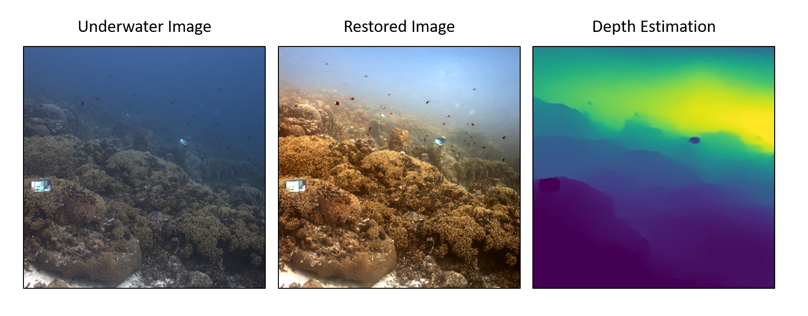

[Paper](link) , [Project Page](https://osmosis-diffusion.github.io/)

# Osmosis - RGBD Diffusion Prior for Underwater Image Restoration

This repository contains official PyTorch implementation for __Osmosis - RGBD Diffusion Prior for Underwater Image Restoration__.



This code is based on [guided_diffusion](https://github.com/openai/guided-diffusion), [DPS](https://github.com/DPS2022/diffusion-posterior-sampling) and [GDP](https://github.com/Fayeben/GenerativeDiffusionPrior)

## Abstract
In this work, 

## Prerequisites

- python 3.8

- pytorch 1.13.1

- nvidia-docker (if you use GPU in docker container)

<br />

## Getting started 

### 1) Clone the repository

```
git clone https://github.com/DPS2022/diffusion-posterior-sampling

cd diffusion-posterior-sampling
```

<br />

### 2) Download pretrained checkpoint and data

### Checkpoint

Create a new dirctory "models".

From the [link](https://drive.google.com/file/d/13o2roYPI-2wDOh8LvPHGQIrqRommSuJT/view?usp=drive_link), download the checkpoint "osmosis_outdoor.pt" into models directory.

<br />

### Datasets

#### Underwater images - real data

- __Low__ Resolusion set - [link](https://drive.google.com/drive/folders/1g6WAF6RAQlen84bMFNIMq-U-3XJ7oN65?usp=sharing) - 256x256
- __High__ Resolusion set -[link](https://drive.google.com/drive/folders/12c8MDPEHgOSSMLZ0l-eFCs8iIQoOPuVN?usp=sharing)

Underwater images are taken from 3 deataset: [SQUID](https://csms.haifa.ac.il/profiles/tTreibitz/datasets/ambient_forwardlooking/index.html), 
[SeaThru](https://csms.haifa.ac.il/profiles/tTreibitz/datasets/sea_thru/index.html) 
and [SeaThru-Nerf](https://sea-thru-nerf.github.io/).

<br />


#### Underwater images - Simulated data with Ground Truth
- [Simulation #1](https://drive.google.com/drive/folders/1E4cXHtpNWX3wHrkmiVDF_XUpPnWMOe-0?usp=sharing)

-  [Simulation #2](https://drive.google.com/drive/folders/1_096PIqXR0w4j8ASyZsEPHs1WZj3AscN?usp=sharing)

Description...

<br />

#### Hazed images
[link](https://drive.google.com/drive/folders/18Xpy8MdsIucNIRhTTKD_Q3isbC79TW89?usp=sharing)
Description...

<br />

### 3) Set environment
### [Option 1] Local environment setting

Install dependencies

```
conda create -n osmosis python=3.8

conda activate osmosis
```

See dependencies at environment.yml file

<br />

### [Option 2] Build Docker image

Install docker engine, GPU driver and proper cuda before running the following commands.

Dockerfile already contains command to clone external codes. You don't have to clone them again.

--gpus=all is required to use local GPU device (Docker >= 19.03)

```
docker build -t dps-docker:latest .

docker run -it --rm --gpus=all dps-docker
```

<br />

### 4) Inference

There are 5 possible configurations:

#### a) Underwater Image Restoration and Depth Estimation - real data
Description...

```
python osmosis_sampling.py --config_file ./configs/osmosis_sample_config.yaml
```

<br />

#### b) Underwater Image Restoration and Depth Estimation - simulated data
Description...

```
python osmosis_sampling.py --config_file ./configs/osmosis_simulation_sample_config.yaml
```

<br />

#### c) Hazed Image Restoration and Depth Estimation
Description...

```
python osmosis_sampling.py --config_file ./configs/osmosis_haze_sample_config.yaml
```

<br />

#### d) Check Prior
Description...

```
python osmosis_sampling.py --config_file ./configs/check_prior_sample_config.yaml
```

<br />

#### e) Sample from RGBD Prior - __Without__ guidance
Description...

```
python RGBD_prior_sampling.py --config_file ./configs/RGBD_sample_config.yaml
```

<br />

### Structure of configurations file
You need to write your data directory at data.root. Default is ./data/samples which contains three sample images from FFHQ validation set.

```
conditioning:
    method: # check candidates in guided_diffusion/condition_methods.py
    params:
        scale: 0.5

data:
    name: ffhq
    root: ./data/samples/

measurement:
    operator:
        name: # check candidates in guided_diffusion/measurements.py

noise:
    name:   # gaussian or poisson
    sigma:  # if you use name: gaussian, set this.
    (rate:) # if you use name: poisson, set this.
```

## Citation
If you find our work interesting, please consider citing

```
@inproceedings{
blabla2024osmosis,
title={},
author={{,
booktitle={},
year={},
url={}
}
```
